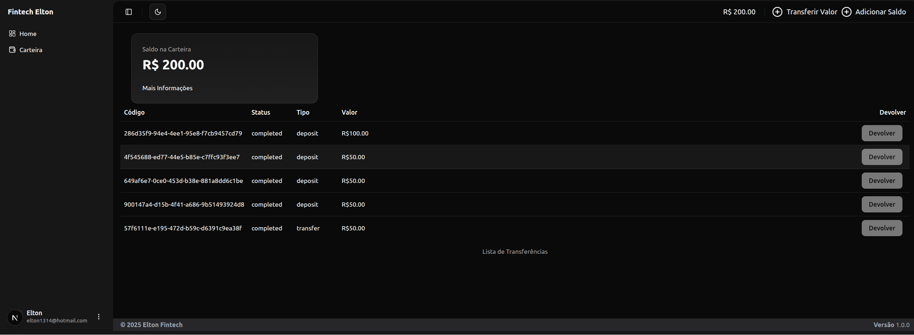
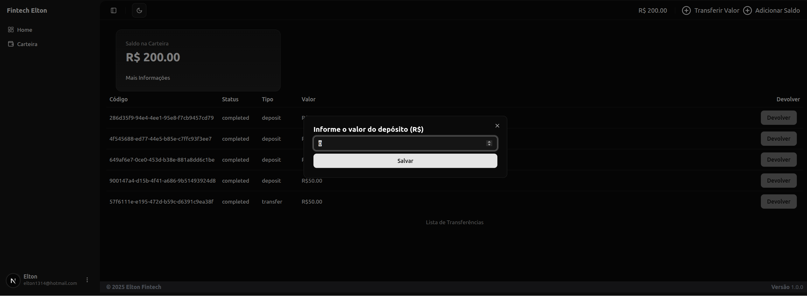
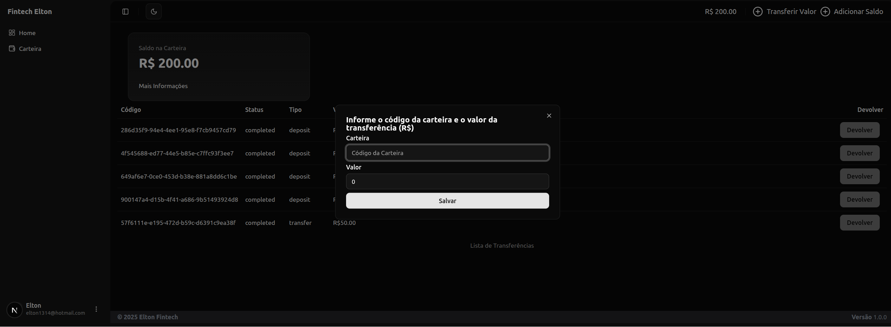

# Fintech Elton Marques

## Funcionalidades

- Criação de Usuário
- Validação de conta via E-mail para habilitar Login
- Login
- Reset de Senha
- Auth com Middleware com JWT
- Criação de Carteira de Usuário (wallet)
- Depósito de Valores
- Transferência entre carteiras
- Devolução de valores

## Ferramentas

### Backend

- NodeJS com NestJS
- Typescript
- Express
- Jest (Tests)
- TypeORM
- Postgres
- SQLite (para testes)
- Pino (Logging)

### Rotas

Grafana - http://localhost:8000/metrics
Swaggger - http://localhost:8000/docs

### Frontend

- ReactJS com NextJS
- Typescript
- ShacdnUI
- Taiwind
- Axios

### Rotas

Frontend - http://localhost:3000

### Telas

Registro - 
Login - 
Esqueci minha senha - 
Dashboard - 
Depósito - 
Transferência - 
